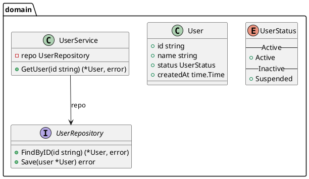

# puml-as-code (`pac`)

[](https://github.com/yur4uwe/puml-as-code/actions/workflows/ci.yml)
[](https://go.dev/)
[](LICENCE.md)

`puml-as-code` is a lightweight, high-performance compiler and transpiler written in Go that translates **PlantUML Class Diagrams** into source code.

---

## Supported Features

- **Rich Entity Mapping:**
  - `class` / `struct` / `record` / `dataclass` &rarr; Go `struct`
  - `interface` / `protocol` / `abstract class` &rarr; Go `interface`
  - `enum` &rarr; Typed integer const block with `iota`
  - `exception` &rarr; Struct implementing the standard Go `error` interface (`Error() string`) with compile-time assertion
- **Comprehensive Relationships & Associations:**
  - **Inheritance (`--|>`)**: Embedded structs or embedded interfaces
  - **Realization (`..|>`)**: Compile-time satisfaction assertions (`var _ Interface = (*Struct)(nil)`)
  - **Composition (`*--`) / Aggregation (`o--`) / Association (`-->`)**: Struct reference fields with cardinality mapping (`1`, `0..1`, `*`, `[N]`)
  - **Dependency (`..>`)**: Type-level dependency annotations
- **Member Modifiers & Encapsulation:**
  - **Visibility**: `+` (public / PascalCase), `-` (private / camelCase), `#` (protected), `~` (package-private)
  - **Static Members (`{static}`)**: Emitted as package-level variables and standalone functions
  - **Abstract Members (`{abstract}`)**: Validated and extracted into companion interfaces
- **Packages & Automatic Imports:**
  - Multi-package diagram layouts (`package foo { ... }`) mapped to directory trees (`<pkg>/types.go`)
  - Automatic detection and import resolution for the **Go Standard Library** (`time.Time`, `context.Context`, `net/http`, etc.)
  - Cross-package qualified type referencing
- **Documentation, Notes & Section Dividers:**
  - Single-line and multi-line comments mapped to Go doc comments
  - PlantUML notes (`note on link`, `note "..." as N`, `note top of X`) converted into doc annotations (`// NOTE: ...`)
  - Diagram visual dividers (`-- Section --`, `== Methods ==`, `.. Info ..`) converted into formatted section comments
- **Generics & Type Parameters:**
  - Generic classes (e.g. `class Container<T>`, `class Cache<K, V>`) mapped to Go type parameters `[T any]`, `[K comparable, V any]`
- **Include Directives:**
  - Splicing and resolution of `!include`, `!include_once`, and `!include_many` file directives

---

## Installation

### Option 1: Using `go install`
```bash
go install github.com/yur4uwe/pac/cmd@latest
```

### Option 2: Build from Source
```bash
git clone https://github.com/yur4uwe/puml-as-code.git
cd puml-as-code
go build -o pac ./cmd/main.go
```

### Option 3: Pre-compiled Binaries
Download the latest pre-compiled binary for Linux, macOS, or Windows from the [GitHub Releases](https://github.com/yur4uwe/puml-as-code/releases) page.

---

## CLI Usage

```bash
pac -in <path-to-diagram.puml> -out <output-directory>
```

### Flags

| Flag | Type | Default | Description |
|------|------|---------|-------------|
| `-in` | string | `""` | **Required.** Path to the input `.puml` diagram file. |
| `-out` | string | `""` | **Required.** Path to the target output directory. |
| `-lang` | string | `"go"` | Target language generator (default: `go`). |
| `-id` | string | `""` | Diagram index (`"0"`, `"1"`) or literal `@startuml <id>` identifier. |

---

## Example

### Input Diagram (`input/service.puml`)


### Run
```bash
pac -in input/service.puml -out ./gen
```

### Generated Output (`gen/domain/types.go`)
```go
package domain

import (
	"time"
)

type UserStatus int

const (

	// --- Active ---

	UserStatusActive UserStatus = iota

	// --- Inactive ---

	UserStatusSuspended
)

type User struct {
	Id        string
	Name      string
	Status    UserStatus
	CreatedAt time.Time
}

type UserRepository interface {
	FindByID(id string) (*User, error)
	Save(user *User) error
}

type UserService struct {
	Repo UserRepository // private
}

func (s *UserService) GetUser(id string) (*User, error) {
	panic("not implemented")
}
```

---

## Architecture

```
┌────────────────┐      ┌─────────────────────────┐      ┌─────────────────────────┐
│  PUML Source   │ ───> │  Recursive-Descent      │ ───> │  Language-Agnostic AST  │
│  Files / Links │      │  Lexer & Parser Pass    │      │  Nodes & Directives     │
└────────────────┘      └─────────────────────────┘      └─────────────────────────┘
                                                                      │
                                                                      ▼
┌────────────────┐      ┌─────────────────────────┐      ┌─────────────────────────┐
│ Target Code    │ <─── │  Template Generator     │ <─── │  Symbol & Dependency    │
│ (Formatted Go) │      │  Engine & go/format     │      │  Resolution Pass        │
└────────────────┘      └─────────────────────────┘      └─────────────────────────┘
```

1. **Lexer & Parser:** Hand-written scanner and recursive-descent parser that constructs a clean AST without executing I/O.
2. **Include & Symbol Resolver:** Resolves `!include` directives, builds pointer-based symbol tables, and scopes package namespaces.
3. **Semantic Pass:** Language-specific validation (e.g. promoting abstract classes to interfaces, preventing stateful interfaces).
4. **Code Generation:** Template-driven rendering formatted with standard toolchains (`go/format`).

---

## Contributing

Contributions, bug reports, and suggestions are warmly welcomed! Please feel free to open an issue or submit a Pull Request.

---

## License

This project is licensed under the [MIT License](LICENCE.md).
