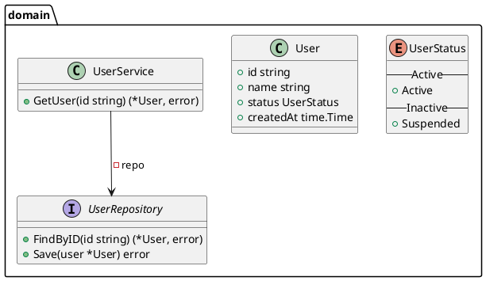
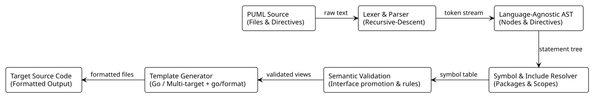

# puml-as-code (`pac`)

> **Turn PlantUML Class Diagrams into Idiomatic Source Code.**  
> A fast, extensible compiler and transpiler written in Go that translates UML
diagrams, relationships, and package hierarchies into formatted, production-ready source code.

[](https://github.com/yur4uwe/puml-as-code/actions/workflows/ci.yml)
[](https://go.dev/)
[](LICENCE.md)

`puml-as-code` is a lightweight, high-performance compiler and transpiler written in Go that translates **PlantUML Class Diagrams** into source code.

---

## Core Capabilities (Language-Agnostic)

`puml-as-code` parses the full specification of PlantUML Class Diagrams into a decoupled, language-agnostic Abstract Syntax Tree (AST) that supports:

- Entity Declarations such as, `class`, `interface`, `struct`, `enum`, `abstract class`, `record`, `dataclass`, `protocol` and `exception`.
- Member Syntax & Modifiers: 
  - Strongly-typed fields and methods via target language-specific dialect*.
  - Modifiers: `{static}` (classifier level) and `{abstract}` (interface constraint).
  - Double-bracket stereotypes (e.g. `<<Service>>`) and generic type parameters (e.g. `<T>`, `<K, V>`).
- Encapsulation (Visibility) - Full support for `+` (public), `-` (private), `#` (protected) and `~` (package-private).
- Comprehensive Relationships & Multiplicities:
  - Generalization / Inheritance (`<|--`, `--|>`)
  - Realization / Interface Implementation (`<|..`, `..|>`)
  - Composition (`*--`) & Aggregation (`o--`)
  - Association (`-->`) & Dependency (`..>`)
  - Cardinality & Multiplicity mapping (`"1"`, `"0..1"`, `"0..*"`, `"*"`), direction modifiers (`-up->`, `-left-`) and relationship role labels.
- Hierarchical Scoping & Namespaces - Nested package containers (`package A.B { ... }`) with scoped lexical environments, qualified cross-package references, and forward-reference symbol resolution.
- Doc Comments & Concrete Syntax Retention - Captures single/multi-line comments, PlantUML notes (`note on link`, `note "..." as N`, targeted notes), and structural dividers (`-- Section --`, `== Methods ==`, `.. Info ..`).

\* *Read more [About Dialects](pkg/parser/dialect/README.md).*

---

## Target Language Backends

`puml-as-code` uses a decoupled template-driven code emission architecture with language-specific semantic passes and formatting toolchains:

### 1. Go (Reference Backend)
- Struct and interface emission with struct embedding for inheritance.
- Cardinality-driven field lowering (pointers `*T`, slices `[]T`, fixed arrays `[N]T`).
- Compile-time interface satisfaction assertions (`var _ IFoo = (*Bar)(nil)`).
- `iota`-based enum const blocks.
- `exception` types auto-implementing Go's `error` interface (`Error() string`).
- Automatic Go Standard Library import detection (`time.Time`, `context.Context`, `net/http`, etc.).
- Canonical AST formatting via standard `go/format`.

### 2. Multi-Target Extensibility
 Designed for straightforward addition of new target backends (TypeScript, Python, Rust, Java, etc.) by implementing:
- target dialect parser (read more [About Dialects](pkg/parser/dialect/README.md))
- semantic pass
- template generator

---

## Installation

### Option 1: Using `go install`
```bash
go install github.com/yur4uwe/pac/cmd@latest
```

### Option 2: Build from Source
```bash
git clone https://github.com/yur4uwe/puml-as-code.git
cd puml-as-code
go build -o pac ./cmd/main.go
```

### Option 3: Pre-compiled Binaries
Download the latest pre-compiled binary for Linux, macOS, or Windows from the [GitHub Releases](https://github.com/yur4uwe/puml-as-code/releases) page.

---

## CLI Usage

```bash
pac -in <path-to-diagram.puml> -out <output-directory>
```

### Flags

| Flag | Type | Default | Description |
|------|------|---------|-------------|
| `-in` | string | `""` | **Required.** Path to the input `.puml` diagram file. |
| `-out` | string | `""` | **Required.** Path to the target output directory. |
| `-lang` | string | `"go"` | Target language generator (default: `go`). |
| `-id` | string | `""` | Diagram index (`"0"`, `"1"`) or literal `@startuml <id>` identifier. |

---

## Example

### Input Diagram (`input/service.puml`)


### Run
```bash
pac -in input/service.puml -out ./gen
```

### Generated Output (`gen/domain/types.go`)
```go
package domain

import (
	"time"
)

type UserStatus int

const (

	// --- Active ---

	UserStatusActive UserStatus = iota

	// --- Inactive ---

	UserStatusSuspended
)

type UserRepository interface {
	FindByID(id string) (*User, error)
	Save(user *User) error
}

type User struct {
	Id        string
	Name      string
	Status    UserStatus
	CreatedAt time.Time
}

type UserService struct {
	repo *UserRepository // private
}

func (s *UserService) GetUser(id string) (*User, error) {
	panic("not implemented")
}
```

---

## Architecture

<!--
@startuml(id=ARCH) docs/images/architecture.svg
!theme plain
skinparam roundcorner 8
skinparam shadowing false

rectangle "PUML Source\n(Files & Directives)" as Input
rectangle "Lexer & Parser\n(Recursive-Descent)" as Parser
rectangle "Language-Agnostic AST\n(Nodes & Directives)" as AST
rectangle "Symbol & Include Resolver\n(Packages & Scopes)" as Resolver
rectangle "Semantic Validation\n(Interface promotion & rules)" as Semantic
rectangle "Template Generator\n(Go / Multi-target + go/format)" as Generator
rectangle "Target Source Code\n(Formatted Output)" as Output

Input -right-> Parser : raw text
Parser -right-> AST : token stream
AST -down-> Resolver : statement tree
Resolver -left-> Semantic : symbol table
Semantic -left-> Generator : validated views
Generator -left-> Output : formatted files
@enduml
-->



1. Lexer: lazy-resolving source markup scanner.
2. Parser: recursive-descent LL(*) parser that constructs language-agnostic AST without executing I/O.
2. Include Resolver: provides in-place AST expansion for `!include` and `!include_once` directives with cyclic dependency detection. Provides support for `!include_many` directive for boilerplate inclusion.
4. Symbol Resolver: builds pointer-based symbol table, and scopes package namespaces.
3. Semantic Pass: Language-specific validation (implemented per language) (e.g. for golang: promoting abstract classes to interfaces, preventing stateful interfaces).
4. Code Generation: Template-driven rendering formatted with standard toolchains (implemented per language) (e.g. `go/format`).

---

## Contributing

Contributions, bug reports, and suggestions are warmly welcomed! Please feel free to open an issue or submit a Pull Request.

---

## License

This project is licensed under the [MIT License](LICENCE.md).
