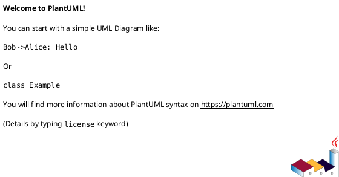

# Parser Quirks

This document contains the list of quirks that parser has due to the limitations of representation via tokens and my own laziness

**Note:** The word `space` that appears i this document refers to `0x20` ascii character.

# List

## Uml diagrams bounds quirks
- parser expects this structure of the start marker:
1. `@` symbol
2. `start` keyword
3. type of diagram (e.g. `uml`, `gantt`, etc.) without spaces between it and `start`
4. One of the following:
    - id of the diagram (e.g. `(id=tag)`)
    - options (e.g. `{filename.puml, foo bar, key=value}`)
    - filename (e.g. `filename.puml`)
Spaces are allowed but not required between `@startuml` and id or options, but are required before filename.
5. if
    - id is present then filename can still be present and so are options
    - filename is present then nothing can follow it
    - options are present then nothing can follow them

To sum up these rules:

### Valid:

### Invalid:

Other related quirks:
- Caption cannot contain equal sign after a word as it will be considered as a key=value pair and parsed accordingly

## Skinparams quirks
- Parser expects any capitalization form of the target, param, and stereotype as:
    - target is .ToLower()'ed and so is the param
    - stereotype is simply read as it is
- Though language spec disallows a space param and stereotype, parser allows it
